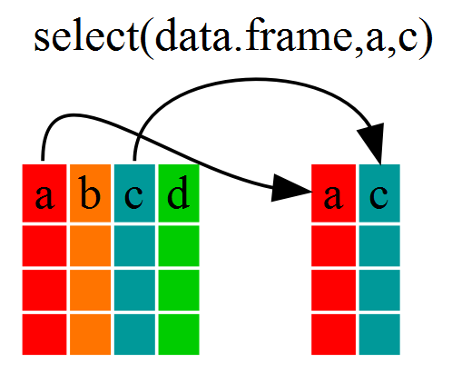
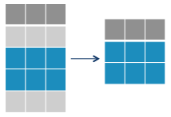
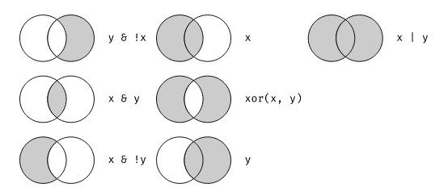

class: center, middle

.linea-superior[]
.linea-inferior[]


## Capacitación en R

## Procesamiento de bases de datos

### Agosto 2020

```{r setup, include=FALSE}
options(htmltools.dir.version = FALSE)
knitr::opts_chunk$set(message = FALSE) 
```

```{r xaringan-themer, include=FALSE, warning=FALSE}
library(xaringanthemer)
```

---

background-image: url("imagenes/fondo2.PNG")
background-size: contain;
background-position: 100% 0%

# Contenidos de hoy

El objetivo de esta sesión es aprender a manipular data frame.

Para cumplir con el objetivo, revisaremos los siguientes temas:

--

- Un breve resumen de lo visto en la sesión anterior.

--

- Importación de datos a R (.csv, .xlsx, .dta, .sav, .RData).

--

- Funciones del paquete **dplyr** para la manipulación de data frames.

--

- Encadenamiento de instrucciones: uso de **pipes**.

--

- Agrupación de unidades (**group_by**).

---

background-image: url("imagenes/fondo2.PNG")
background-size: contain;
background-position: 100% 0%

# Breve resumen

Antes de avanzar, una recopilación de los puntos vistos en la primera sesión y que serán necesarios en esta sesión

--

- **¿Qué es un script?**

Corresponde a un documento de texto en el cual se escribe una serie de instrucciones para R.

--

- **¿Qué es un paquete?**

Corresponde a una colección de `funciones` diseñadas para atender distintas tareas. Los paquetes complementan a las funciones de base existentes en R. Para poder ejecutar estas funciones, es necesario instalar el `paquete` y cargar las `librerías`.

--

- **¿Qué es una función**

Corresponde a un conjunto de instrucciones que permite automatizar rutinas largas y/o complicadas.

--

```{r , warning=FALSE}
round(x = c(4.5, 4.4444449), digits = 1)
```

---

background-image: url("imagenes/fondo2.PNG")
background-size: contain;
background-position: 100% 0%

# Breve resumen

- **¿Cómo se asigna un valor a un elemento?**

--

```{r , warning=FALSE}
# Utilizando la expresión "<-" se asigna un valor.
z <- 1
# El objeto con el valor asignado se puede usar en funciones.
zz <- z + 3
# print() se utiliza para mostrar el valor del objeto en la consola.
print(zz)
```

--

- **¿Qué es un vector?**:

Es el objeto más básico en R. Este objeto es una forma de almacenar datos.


```{r, warning=FALSE}
x <- c(1:2, seq(from = 0, to = 5, by = 2))
print(x)
```

---

background-image: url("imagenes/fondo2.PNG")
background-size: contain;
background-position: 100% 0%

# Breve resumen

- **Tipos de vectores**

```{r, warning=FALSE, eval=FALSE}
character = c("gato", "perro")
numeric   = c(8, 15.9, -2.1)  # números reales
integer   = c(2L, 4L) # L indica que son enteros
logical   = c(TRUE, FALSE, TRUE)
complex   = 3 + 4i
```

--

Los vectores son atómicos. <b>¿Qué significa esto?</b>

--

```{r, warning=FALSE}
v <-  c("gato", 1)
class(v)
v <-  c(1L, 2.2)
typeof(v)
```

---

background-image: url("imagenes/fondo2.PNG")
background-size: contain;
background-position: 100% 0%

# Breve resumen

- **Operadores matemáticos**

```{r, warning=FALSE, eval=FALSE}
x + y   # suma
x - y   # resta
x * y   # multiplicación
x / y   # división
x ^ y   # exponenciación
x %% y  # módulo
x %/% y # cociente
```

--

Al realizar una operación matemática sobre dos vectores, la operación se realiza entre los componentes que ocupan la misma `posición` en ambos vectores.

```{r, warning=FALSE}
x <- c(0, 1, 2)
y <- c(0, -2, 1)
x + y
```

---

background-image: url("imagenes/fondo2.PNG")
background-size: contain;
background-position: 100% 0%

# Breve resumen

- **Operadores relacionales**

```{r, warning=FALSE, eval=FALSE}
x < y     # x menor que y
x > y     # x mayor que y
x <= y    # x menor o igual que y
x >= y    # x mayor o igual que y
x == y    # x igual a y
x != y    # x distinto a y
```

--

Al realizar una operación relacional entre dos vectores, la **relación** se realiza entre los componentes que ocupan la misma `posición` en ambos vectores.

--

El resultado de una operación relacional es **TRUE** o **FALSE** en cada componente del nuevo vector.

```{r, warning=FALSE}
x <- c(0, 1, 2)
y <- c(0, -2, 1)
x == y
```

---

background-image: url("imagenes/fondo2.PNG")
background-size: contain;
background-position: 100% 0%

# Breve resumen

- **Operadores lógicos (booleanos)**

```{r, warning=FALSE, eval=FALSE}
x | z     # x o z es verdadero
x & z     # x y z son verdaderos
!x        # x no es verdadero (negación)
isTRUE(x) # x es verdadero (afirmación)
```

--

Las operaciones lógicas analizan el valor de verdad de dos sentencias.

--

```{r, warning=FALSE}
(24 > 5) & (-1 * -1 > 0)
length(c(1:10)) == length(seq(from = 1, to = 10, by = 2))
```

--

- **Indexación**

```{r, warning=FALSE}
c(1:2, "perro", 10:12)[5] # El quinto elemento
```

---

background-image: url("imagenes/fondo2.PNG")
background-size: contain;
background-position: 100% 0%

# Breve resumen

- **¿Qué es un data frame?**

Es una estructura de datos de dos dimensiones (rectangular) que puede contener datos de diferentes tipos, por lo tanto, es heterogénea. Esta estructura de datos es la más usada para realizar análisis de datos, y es la estructura con la cual trabajaremos en esta sección.

--

- **Comando $**

Se utiliza para vincular una variable con un objeto.

--

- **Función table()**

Se utiliza para tabular un resultado.

--

```{r, warning=FALSE}
x <- data.frame(nombres = c("Ignacio", "Klaus", "Juan", "Ignacio"))
# Tabulación
table(x$nombres)
```

---

background-image: url("imagenes/import.jpg")
background-size: cover
class: center, bottom, inverse

# Importación de datos

---

background-image: url("imagenes/fondo2.PNG")
background-size: contain;
background-position: 100% 0%

# Importación de datos

<b>R</b> tiene distintos paquetes para importar datos, diferenciando la extensión de los archivos.

--

- Para importar archivos delimitados (.csv, .txt, .tab), existe el paquete `readr`. Dentro de las funciones de ese paquete, la función `read_csv()` permite la importación de archivos con la extensión "**.csv**".

```{r, warning=FALSE, eval=FALSE}
# Para usar el paquete primero es necesario cargarlo
library(readr)
# Al usar la función, asignamos el archivo a un valor
base_csv  <-  read_csv(file = "ejemplo.csv")
```

--

- El paquete `readxl` nos permite importar archivos de Excel. Una de sus funciones es read_excel().

```{r, warning=FALSE, eval=FALSE}
# Para usar el paquete primero es necesario cargarlo
library(readxl)
# Al usar la función, asignamos el archivo a un valor
base_excel  <-  read_excel(file = "ejemplo_excel.xlsx", sheet="Hoja1")
```

---

background-image: url("imagenes/fondo2.PNG")
background-size: contain;
background-position: 100% 0%

# Importación de datos

Tanto las funciones de `readr` como `readxl` tienen argumentos que permiten setear distintas opciones para la importación.

--

<br>

.pull-left[
### `readr`

- Cambiar nombres de columnas

- Saltarse líneas al momento de importar

- Recodificar valores perdidos
]

.pull-right[
### `readxl`

- Leer un rango específico de la hoja de cálculo

- Cambiar nombres de columnas

- Saltarse líneas al momento de importar

- Recodificar valores perdidos
]

---

background-image: url("imagenes/fondo2.PNG")
background-size: contain;
background-position: 100% 0%

# Importación de datos

.pull-left[
Para importar archivos guardados desde Stata o SPSS existe el paquete `haven`.

Al igual que los paquetes `readxl` o `readr` tiene funciones bastante explícitas respecto de lo que hacen:

- **SPSS**: `read_sav()` permite importar archivos ".sav".

- **Stata**: `read_dta()` permite importar archivos ".dta".
]

.pull-right[
.center[

]
]

```{r, warning=FALSE, eval=FALSE}
# Cargar librería
library(haven)
# Se puede importar una base de datos desde una carpeta...
esi <-  read_dta("data/esi_2018_personas.dta")
# ...o se puede descargar desde un sitio web
esi <-  read_csv("http://www.ine.cl/docs/default-source/encuesta-suplementaria-de-ingresos/bbdd/csv/2018/esi_2018_personas.csv")
```

---

background-image: url("imagenes/fondo2.PNG")
background-size: contain;
background-position: 100% 0%

# Importación de datos

Los archivos de R tienen la extensión `.RData`.

--

Para importar estas bases se usa el comando `load()`.

--

La importación de un archivo en R no requiere una asignación de valor.

--

Estos archivos puede incluir más de un objeto.

--

```{r, warning=FALSE}
load(file = "data/Censo_area.RData")
```

--

Comencemos con nuestro ejercicio...

--

Importemos el archivo de Excel "**`Censo_area.xlsx`**"... 

--

**¿Qué función debemos utilizar?**

---

background-image: url("imagenes/fondo2.PNG")
background-size: contain;
background-position: 100% 0%

# Importación de datos

Debemos utilizar la función `read_excel` de la librería `readxl`.

--

Esta función requiere indicar el nombre de la base a importar, así como la ruta en donde se encuentra guardada.

--

**IMPORTANTE**: al escribir la ruta, se debe utilizar el símbolo `/`.

--

```{r, warning=FALSE}
library(readxl)
base <- read_excel(path = "data/Censo_area.xlsx")
```

--

¿Cómo se puede revisar la estructura de la base de datos?

--

```{r, warning=FALSE}
str(base)
```

--

Ahora que importamos la base de datos, trabajaremos con la manipulación de los data frames.

---

background-image: url("imagenes/transformer.gif")
background-size: cover
class: center, bottom, inverse

# Transformación de datos

---

background-image: url("imagenes/fondo2.PNG")
background-size: contain;
background-position: 100% 0%

# Transformación de datos

## El paquete `dplyr`


.pull-left[

Para la manipulación de los data frames existe un paquete llamado **`dplyr`**.

Este paquete fue desarrollado por Hardley Wickman de RStudio.

Es una versión optimizada de un paquete anterior llamado `plyr`.
 
El paquete `dplyr` proporciona una "gramática" (particularmente verbos) para la manipulación y operaciones con data frames.
 
Los paquetes `dplyr`, `readr`, `readxl` y `haven` forman parte del universo de [`tidyverse`](https://www.tidyverse.org).

]

.pull-right[
.center[

]
]

---

background-image: url("imagenes/fondo2.PNG")
background-size: contain;
background-position: 100% 0%

# Transformación de datos

Durante esta sesión veremos siete funciones del paquete **`dplyr`** que se utilizan para la manipulación de data frames.

--

- **select**: selecciona y devuelve un conjunto de columnas.

--

- **filter**: selecciona y devuelve un conjunto de filas según una o varias condiciones lógicas.

--

- **arrange**: reordena filas de un data frame.

--

- **rename**: renombra variables en un data frame.

--

- **mutate**: añade nuevas variables o transforma variables existentes.

--

- **group_by**: agrupa filas de un data frame.

--

- **summarise**: genera resúmenes estadísticos.

--

Estas funciones serán algunas de nuestras mejores compañeras y siempre nos acompañarán en nuestro camino de programación.

---

background-image: url("imagenes/fondo2.PNG")
background-size: contain;
background-position: 100% 0%

# Transformación de datos

Todas estas funciones tienen en común una serie de argumentos:

--

- El primer argumento es el data frame a manipular.

--

- Los otros argumentos describen que hacer con el data frame especificado en el primer argumento.

--

-	El valor de retorno de la función es un nuevo data frame.

--

Como veremos en esta sesión, una de las principales ventajas de estas funciones es que podemos referirnos a las columnas en el data frame directamente sin utilizar el operador “**`$`**”, es decir, solo con el nombre de la variable.

---

background-image: url("imagenes/fondo2.PNG")
background-size: contain;
background-position: 100% 0%

# Transformación de datos

## Función `select()`

La primera función que veremos es la función **`select()`**.

--

Esta función fue vista en la sesión anterior, y es utilizada para seleccionar columnas dentro de un data frame.

--

El resultado de esta función corresponde a un data frame que solo incluye las variables seleccionadas.

--

.center[

]

---

background-image: url("imagenes/fondo2.PNG")
background-size: contain;
background-position: 100% 0%

# Transformación de datos

## Función `select()`

El orden definido en la selección de variables, es el orden que tendrán las columnas en el resultado.

--

La selección puede ser realizada...

--

.pull-left[
...según nombre de la variable.

```{r, warning=FALSE}
library(dplyr)
head(select(base, c(EDAD, N)))
```
]

--

.pull-right[
...según índice de la variable.

```{r, warning=FALSE}
library(dplyr)
head(select(base, 3, 2))
```
]

---

background-image: url("imagenes/fondo2.PNG")
background-size: contain;
background-position: 100% 0%

# Transformación de datos

## Función `select()`

Esta función permite utilizar varias **`funciones auxiliares`** para indicar las columnas a extraer:

--

- **Al incluir el signo menos ("`-`") antes de la selección**: se indica que columnas **NO** serán extraídas.

--

- **Al incluir "`:`" entre los indicadores de columnas**: permite seleccionar un rango de variables.

--

- **La función "`starts_with`"**: selecciona todas las columnas que comienzan con el patrón indicado.

--

- **La función "`ends_with`"**: selecciona todas las columnas que terminen con el patrón indicado.

---

background-image: url("imagenes/fondo2.PNG")
background-size: contain;
background-position: 100% 0%

# Transformación de datos

## Función `select()`

- **La función "`contains`"**: selecciona las columnas que posean el patrón indicado.

--

- **La función "`matches`"**: funciona similar a contains, pero permite poner una [`expresión regular`](https://rpubs.com/ydmarinb/429756).

--

Una expresión regular corresponde a una secuencia de caracteres que forma un patron de búsqueda.

--

- **La función "`everything`"**: sirve como bolsa para seleccionar todas las variables no seleccionadas explícitamente.

--

- **La función "`one_of`"**: selecciona variables cuyo nombre están en un grupo de nombres.

---

background-image: url("imagenes/fondo2.PNG")
background-size: contain;
background-position: 100% 0%

# Transformación de datos

## Función `select()`

Realicemos algunos ejercicios...

--

Creemos un data frame:

```{r, warning=FALSE}
df <- data.frame(x1 = c(1:3),
                 x2 = c(1,7,2),
                 x3 = c("a","b","c"),
                 x4 = c(5,-1,8),
                 x5 = c("perro","gato","conejo"))
```

--

Ahora que creamos el data frame, realicemos algunas selecciones:

--

- Seleccionemos todas las columnas excepto x4 y x5.

--

- Reordenemos las columnas en el siguiente orden: x1, x5, x3, x2 y x4.

---

background-image: url("imagenes/fondo2.PNG")
background-size: contain;
background-position: 100% 0%

# Transformación de datos

## Función `filter()`

--

Esta función se utiliza para filtrar un data frame según alguna condición a definir.

--

Así como la función `select` es utilizada para seleccionar columnas de un data frame, la función `filter` puede ser entendida como la selección de filas de un data frame.

--

.center[

]

---

background-image: url("imagenes/fondo2.PNG")
background-size: contain;
background-position: 100% 0%

# Transformación de datos

## Función `filter()`

¿Es posible filtrar en base a más de una condición?

--

**SI**, es posible utilizando operadores lógicos.

--

.center[

]

--

La figura pertenece a [`R para ciencia de datos`](https://es.r4ds.hadley.nz/index.htmlhttps://es.r4ds.hadley.nz/index.html).

---

background-image: url("imagenes/fondo2.PNG")
background-size: contain;
background-position: 100% 0%

# Transformación de datos

## Función `filter()`

Por ejemplo, si queremos filtrar nuestra base, y seleccionar a las mujeres de la región 6 y de edad 35, debemos hacer lo siguiente...

--

```{r, warning=FALSE}
library(dplyr)
filter(.data = base, SEXO == 2 & CÓDIGO_REGIÓN == 6 & EDAD == 35)
```

--

**Ejercicio**: filtrar el data frame "df", según los criterios: x1 > 2 y x5 es distinto de "perro".

---

background-image: url("imagenes/fondo2.PNG")
background-size: contain;
background-position: 100% 0%

# Transformación de datos

## Función `arrange()`

--

Como se vio en la sesión anterior, esta función se utiliza para reordenar las filas de un data frame:

--

- El orden se puede realizar según una o más columnas.

--

- El reordenamiento se realiza según el orden de las columnas seleccionadas.

--

- Por defecto, el orden es ascendente.

--

- Para ordenar de manera descendente se debe utilizar la función auxiliar `desc()`.

```{r, warning=FALSE}
library(dplyr)
arrange(.data = df,x4,desc(x2))
```

---

background-image: url("imagenes/fondo2.PNG")
background-size: contain;
background-position: 100% 0%

# Transformación de datos

## Función `rename()`

--

Si queremos **`renombrar`** una variable (columna) de un data frame, existen múltiples formas y varias muy complejas.

--

La función `rename` permite modificar el nombre de una variable de una manera sencilla, sin editar el resto de variables.

--

Para obtener el nombre de las variables en un data frame se utiliza la función `names()`.

--

```{r, warning=FALSE}
library(dplyr)
# Función para obtener nombres de las columnas
names(df)
```

---

background-image: url("imagenes/fondo2.PNG")
background-size: contain;
background-position: 100% 0%

# Transformación de datos

## Función `rename()`

Una forma de renombrar una variable es la siguiente...

--

```{r, warning=FALSE}
library(dplyr)
# Renombrar una columna
names(df)[names(df) == "x1"] <- "var1"
```

--

...y otra es utilizando la función **`rename`**.

--

```{r, warning=FALSE}
library(dplyr)
# Renombrar una columna
rename(.data = df,var2 = x2)
```
---

background-image: url("imagenes/fondo2.PNG")
background-size: contain;
background-position: 100% 0%

# Transformación de datos

## Función `mutate()`

La función **`mutate()`** tiene la finalidad de realizar transformaciones sobre los valores de un data frame.

--

Algunas de las transformaciones posibles son:

--

- Cambiar el formato de una variable.

--

```{r, warning=FALSE}
library(dplyr)
# Cambiar el formato de una variable
class(df$x4)
df <- mutate(.data = df, x4 = as.character(x4))
class(df$x4)
```

---

background-image: url("imagenes/fondo2.PNG")
background-size: contain;
background-position: 100% 0%

# Transformación de datos

## Función `mutate()`

- Modificar el valor de alguna variable.

En este caso se requiere la utilización de una función auxiliar llamada **`if_else()`**. Esta función trabaja con los siguientes argumentos: `condition`, `true`, `false` y `missing`.

--

```{r, warning=FALSE}
library(dplyr)
# Modificar la edad "100 o más" por 100
base <- mutate(.data = base,
               EDAD = if_else(condition = EDAD == "100 o más",
                              true = "100",
                              false = EDAD))
table(base$EDAD == "100")
```

---

background-image: url("imagenes/fondo2.PNG")
background-size: contain;
background-position: 100% 0%

# Transformación de datos

## Función `mutate()`

- Permite modificar el valor de más de una variable. La modificación se realiza de izquierda a derecha.

--

- Permite crear una variable que no existe

--

A continuación un pequeño ejercicio...

--

Utilizando el data frame `df`, generar una variable `x1` con los mismos valores de `var1`. Luego, generar una variable `x6` cuyos valores sean igual a `x1 + x2`. Asignar el resultado de la función al data frame `df`.

--

```{r, warning=FALSE}
library(dplyr)
df <- mutate(.data = df,
            x1 = var1,
            x6 = x1 + x2)
head(df)
```

---

background-image: url("imagenes/fondo2.PNG")
background-size: contain;
background-position: 100% 0%

# Transformación de datos

Hasta ahora hemos visto como `renombrar` variables, como `seleccionar` columnas, como `filtrar` filas, como `reordenar` las filas y como `crear/transformar` variables en un data frame.

--

Realicemos un ejercicio aplicando lo aprendido:

- Utilizando el data frame `base`, renombrar la variable `CÓDIGO_REGIÓN` y asignarle el nombre `Region`. El resultado guardarlo en el objeto `resultado`.

Las siguientes transformaciones realizarlas sobre el objeto `resultado`.

- Reordenar las columnas de forma tal que la columna `N` corresponda a la última columna del data frame.

- Cambiar el formato de las variables `Región` y `EDAD`, y convertirlas en variables numéricas (usar `as.numeric()`).

- Reordenar las filas de acuerdo a: `Región`, `EDAD` y `SEXO`.

---

background-image: url("imagenes/fondo2.PNG")
background-size: contain;
background-position: 100% 0%

# Transformación de datos

El resultado es el siguiente:

```{r, warning=FALSE}
library(dplyr)
# Renombrar
resultado <- rename(.data = base, Region = CÓDIGO_REGIÓN)
# Seleccionar
resultado <- select(.data = resultado, c(1,2,4,5,3))
# Cambiar el formato
resultado <- mutate(.data = resultado, Region = as.numeric(Region),
                    EDAD = as.numeric(EDAD))
# Reordenar filas
resultado <- arrange(.data = resultado, Region, EDAD, SEXO)
# Miremos el resultado
head(resultado, n = 5)
```

--

¿Es posible encadenar todas estas instrucciones?
--
 Si, utilizando el operador **`%>%`** (llamado **pipe**)

---

background-image: url("imagenes/pipes.jpg")
background-size: cover
class: center, bottom, inverse

# <b><font color = "Black">Uso de pipes</font></b>

---

background-image: url("imagenes/fondo2.PNG")
background-size: contain;
background-position: 100% 0%

# Uso de pipes

El operador **%>%** nos permite tomar el resultado de una función y mandarlo directamente a la siguiente función, concatenando acciones.

--

Se puede leer como "luego" o "a continuación".

--

Este operador nos ayudará enormemente a mejorar la legibilidad de un código.

--

El atajo para escribir `pipes` en Windos es: ctrl + shift + M.

En Mac es: cmd + shif + M

--


---

background-image: url("imagenes/fondo2.PNG")
background-size: contain;
background-position: 100% 0%

# Uso de pipes

Utilizando pipes, el resultado del ejercicio anterior es posible escribirlo de la siguiente manera:

```{r, warning=FALSE, eval=FALSE, eval=FALSE}
library(dplyr)
resultado <- base %>%
  rename(Región = CÓDIGO_REGIÓN) %>%
  select(1,2,4,5,3) %>%
  mutate(Región = as.numeric(Región),
         EDAD = as.numeric(EDAD)) %>%
  arrange(Región, EDAD, SEXO)
```
